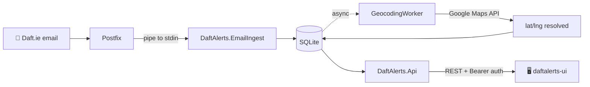

# 📬 DaftAlerts — Documentation

[](https://dotnet.microsoft.com/)
[](https://github.com/guibranco/daftalerts-api/actions/workflows/ci.yml)
[](https://codecov.io/gh/guibranco/daftalerts-api)
[](../LICENSE)
[](https://github.com/guibranco/daftalerts-api/pkgs/container/daftalerts-api)

> Your Daft.ie inbox, organized. A personal property-alert aggregator that ingests Daft.ie email alerts via SMTP piping, parses them into structured listings, and serves a filtered REST API backed by SQLite and Google Maps geocoding.

---

## 🗺️ Documentation map

| Document | What's inside | Who it's for |
| --- | --- | --- |
| 📐 [ARCHITECTURE.md](./ARCHITECTURE.md) | Clean Architecture layers, project dependencies, data flow diagrams, background workers | Developers, new contributors |
| 🚀 [DEPLOYMENT.md](./DEPLOYMENT.md) | Step-by-step OCI Ubuntu VPS setup — Postfix, systemd, Nginx, Let's Encrypt, Docker Compose | Operators, self-hosters |
| 🔍 [PARSER.md](./PARSER.md) | How the Daft.ie email parser works, supported variants, adding new cases | Developers extending ingestion |
| 🌐 [API.md](./API.md) | Full REST endpoint reference, auth, filters, pagination, examples | Frontend developers, API consumers |
| 🧭 [DECISIONS.md](./DECISIONS.md) | Architecture Decision Records (ADRs) — why SQLite, why Clean Arch, why SMTP piping | Anyone wondering "why this way?" |

---

## ⚡ Quickstart

### Run locally (without Docker)

```bash
# 1. Clone
git clone https://github.com/guibranco/daftalerts-api.git
cd daftalerts-api

# 2. Restore and build
dotnet restore DaftAlerts.sln
dotnet build DaftAlerts.sln --configuration Release

# 3. Apply migrations (creates ./data/daftalerts.db)
dotnet ef database update \
  --project src/DaftAlerts.Infrastructure \
  --startup-project src/DaftAlerts.Api

# 4. Configure secrets (create appsettings.Development.json)
cat > src/DaftAlerts.Api/appsettings.Development.json <<EOF
{
  "Auth": { "ApiToken": "dev-local-token" },
  "Geocoding": { "GoogleApiKey": "YOUR_KEY_HERE" }
}
EOF

# 5. Run
dotnet run --project src/DaftAlerts.Api
```

The API listens on `http://localhost:5080`. Swagger/Scalar UI at `/scalar/v1` in Development.

### Run with Docker

```bash
docker run -d \
  --name daftalerts-api \
  -p 5080:5080 \
  -v daftalerts-data:/var/lib/daftalerts \
  -e DaftAlerts__Auth__ApiToken=dev-local-token \
  -e DaftAlerts__Geocoding__GoogleApiKey=YOUR_KEY_HERE \
  ghcr.io/guibranco/daftalerts-api:latest
```

Full production deployment (Postfix + systemd + Nginx) is in [DEPLOYMENT.md](./DEPLOYMENT.md).

---

## 🧱 Project layout

```
daftalerts-api/
├── src/
│   ├── DaftAlerts.Domain/          Entities, value objects
│   ├── DaftAlerts.Application/     Use cases, DTOs, interfaces
│   ├── DaftAlerts.Infrastructure/  EF Core, parsing, geocoding
│   ├── DaftAlerts.Api/             Minimal API host
│   └── DaftAlerts.EmailIngest/     SMTP-pipe console app
├── tests/                          xUnit + FluentAssertions
├── deploy/                         Postfix, systemd, install scripts
├── docs/                           ← you are here
├── Dockerfile
└── DaftAlerts.sln
```

Detailed dependency rules and rationale live in [ARCHITECTURE.md](./ARCHITECTURE.md).

---

## 🔄 Data flow at a glance



For the full data-flow diagram and the three hosted services (`GeocodingWorker`, `RetentionCleanupWorker`, `ParseRetryWorker`), see [ARCHITECTURE.md](./ARCHITECTURE.md#background-workers).

---

## 🧪 Common tasks

| Task | Command |
| --- | --- |
| Run all tests | `dotnet test DaftAlerts.sln --configuration Release` |
| Run with coverage | `dotnet test --collect:"XPlat Code Coverage"` |
| Add a migration | `dotnet ef migrations add <Name> --project src/DaftAlerts.Infrastructure --startup-project src/DaftAlerts.Api` |
| Publish EmailIngest binary | `dotnet publish src/DaftAlerts.EmailIngest -c Release -r linux-x64 --self-contained -p:PublishSingleFile=true` |
| Build Docker image locally | `docker build -t daftalerts-api:dev .` |
| View API docs (dev only) | Open `http://localhost:5080/scalar/v1` |
| Replay a failed email | See [PARSER.md § ParseRetryWorker](./PARSER.md#parse-retry) |

---

## 🔐 Security & operations

- **Auth** — single static bearer token via `Auth:ApiToken` (see [DEPLOYMENT.md § Secrets](./DEPLOYMENT.md#secrets))
- **Rate limiting** — 300 req/min per IP on `/api/*`
- **HTTPS** — enforced in production via Nginx + Let's Encrypt
- **Retention** — raw emails deleted after 90 days (`Retention:RawEmailDays`)
- **Backups** — SQLite file at `/var/lib/daftalerts/daftalerts.db`; see [DEPLOYMENT.md § Backups](./DEPLOYMENT.md#backups) for cron-based snapshot strategy

Report security issues privately — see [SECURITY.md](../SECURITY.md) at the repo root.

---

## 🔗 Related repositories

| Repo | Description |
| --- | --- |
| [guibranco/daftalerts-api](https://github.com/guibranco/daftalerts-api) | This repository — backend API and email ingestion |
| [guibranco/daftalerts-ui](https://github.com/guibranco/daftalerts-ui) | React + Vite + TypeScript frontend that consumes this API |

---

## 🆘 Troubleshooting

| Symptom | Likely cause | Where to look |
| --- | --- | --- |
| `unable to open database file` | Missing parent directory | [DEPLOYMENT.md § Database path](./DEPLOYMENT.md#database-path) |
| Emails arrive but don't appear in API | Parser failed — check `RawEmail.ParseStatus` | [PARSER.md § Debugging](./PARSER.md#debugging) |
| Properties missing lat/lng | Geocoding worker stalled or key invalid | [ARCHITECTURE.md § GeocodingWorker](./ARCHITECTURE.md#geocoding-worker) |
| 401 on every API call | Missing or wrong `Authorization: Bearer` header | [API.md § Authentication](./API.md#authentication) |
| Postfix pipe command fails silently | Permission or path issue on the ingest binary | [DEPLOYMENT.md § Postfix](./DEPLOYMENT.md#postfix) |

---

## 🤝 Contributing

This is a personal tool, but if you're forking it and want to upstream something useful:

1. Open an issue first to discuss scope.
2. Keep changes focused — one concern per PR.
3. All tests must pass and coverage must not drop below 80%.
4. Follow the conventions in [ARCHITECTURE.md § Coding conventions](./ARCHITECTURE.md#coding-conventions).

---

## 📜 License

MIT — see [LICENSE](../LICENSE).
