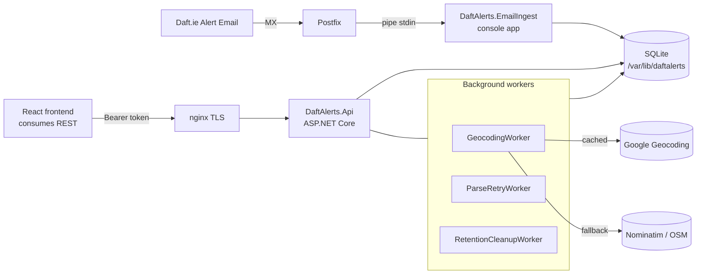

# DaftAlerts

Personal property-alert aggregator for [Daft.ie](https://www.daft.ie). Ingests Daft alert emails via SMTP piping, parses them into structured records, geocodes addresses, and exposes a REST API consumed by a separate React frontend.

Single-tenant, built for one user: a senior software engineer in Dublin, Ireland, deploying to an Oracle Cloud Infrastructure (OCI) Ubuntu VPS.

## Architecture



## Tech stack

- .NET 10 / ASP.NET Core Minimal APIs
- Entity Framework Core 10 + SQLite (file-based)
- MimeKit + MailKit for email parsing
- HtmlAgilityPack for HTML extraction
- Polly for HTTP retries (Google + Nominatim geocoding)
- Serilog structured logging (console + rolling file)
- FluentValidation for request validation
- Swashbuckle OpenAPI / Swagger UI (dev only)
- xUnit, FluentAssertions, Testcontainers for tests
- Clean Architecture across 5 source projects: Domain ← Application ← Infrastructure ← Api / EmailIngest
- Single-file self-contained publish for EmailIngest (so Postfix can invoke a bare binary)

## Quick start (dev)

```sh
# Requires .NET 10 SDK
dotnet restore
dotnet build

# Run API on http://localhost:5080
dotnet run --project src/DaftAlerts.Api

# Run all tests
dotnet test
```

Set `Auth:ApiToken` in `appsettings.Development.json` (or `DaftAlerts__Auth__ApiToken` env var) to a value of your choosing. Swagger UI is available at `/swagger` in development.

Pipe a sample alert email into the ingest pipeline:

```sh
cat tests/DaftAlerts.Infrastructure.Tests/TestData/sample-daft-herbert-lane.eml \
    | dotnet run --project src/DaftAlerts.EmailIngest
```

## Environment variables (production)

| Key | Purpose |
|---|---|
| `DaftAlerts__Auth__ApiToken` | Bearer token required for `/api/*` calls |
| `DaftAlerts__Geocoding__GoogleApiKey` | Google Geocoding API key (optional; Nominatim used as fallback) |
| `DaftAlerts__Cors__AllowedOrigins__0` | Frontend origin, e.g. `https://daftalerts.example.com` |
| `DaftAlerts__ConnectionStrings__Default` | SQLite connection string |
| `DaftAlerts__Database__AutoMigrate` | `true` to apply migrations on startup |
| `DaftAlerts__Retention__RawEmailDays` | Days to retain raw MIME bytes (default 90) |

## REST API summary

All endpoints except `/health*` and (in dev) `/swagger*` require `Authorization: Bearer <token>`.

| Method | Path | Purpose |
|---|---|---|
| `GET` | `/api/properties?status=inbox&...` | List properties with filters, sort, paging |
| `GET` | `/api/properties/{id}` | Single property |
| `PATCH` | `/api/properties/{id}` | Update status / notes |
| `POST` | `/api/properties/bulk` | Bulk `approve` / `recycle` / `restore` |
| `GET` | `/api/stats` | Counts + avg/median approved price |
| `GET` | `/api/presets` | List filter presets |
| `POST` | `/api/presets` | Create filter preset |
| `PUT` | `/api/presets/{id}` | Update filter preset |
| `DELETE` | `/api/presets/{id}` | Delete filter preset |
| `GET` | `/health` | Liveness |
| `GET` | `/health/ready` | Readiness: DB + geocoding worker |

See [docs/API.md](docs/API.md) for full request/response examples or run the API in development mode and browse `/swagger`.

## Project layout

```
src/
  DaftAlerts.Domain/          Entities, value objects — no deps
  DaftAlerts.Application/     Use cases, DTOs, interfaces, validators
  DaftAlerts.Infrastructure/  EF Core, parser, geocoders, ingestion pipeline
  DaftAlerts.Api/             Minimal API host + hosted workers
  DaftAlerts.EmailIngest/     Console app invoked by Postfix
tests/
  *.Tests/                    Parallel test projects per source project
```

Dependency rule is enforced by project references — no upward references allowed.

## Docs

- [docs/ARCHITECTURE.md](docs/ARCHITECTURE.md) — layer explanations, domain model, flow
- [docs/DEPLOYMENT.md](docs/DEPLOYMENT.md) — step-by-step Ubuntu VPS deploy
- [docs/PARSER.md](docs/PARSER.md) — how the Daft email parser works; how to add variants
- [docs/API.md](docs/API.md) — endpoint reference
- [docs/DECISIONS.md](docs/DECISIONS.md) — ADRs for non-obvious design choices
- [deploy/postfix-setup.md](deploy/postfix-setup.md) — Postfix alias wiring

## License

MIT — see [LICENSE](LICENSE).
