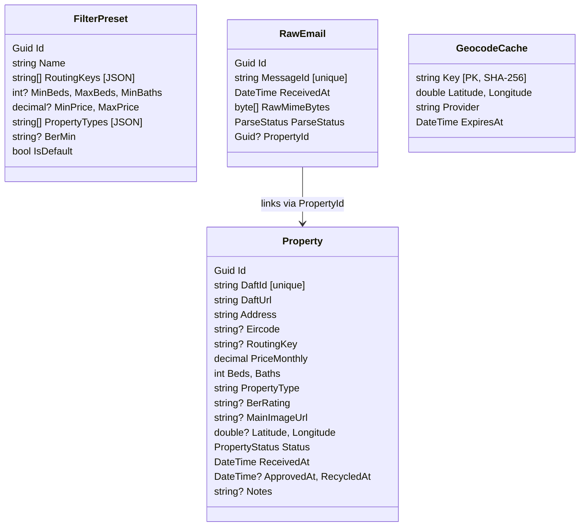

# Architecture

DaftAlerts follows Clean Architecture with the standard dependency flow: **Domain ← Application ← Infrastructure ← Api / EmailIngest**. The dependency rule is enforced at build time by project references; there are no upward references.

## Layers

### Domain (`DaftAlerts.Domain`)

Pure C#, zero NuGet dependencies. Contains:

- **Entities** — `Property`, `FilterPreset`, `RawEmail`, `GeocodeCache`.
- **Enums** — `PropertyStatus` (Inbox / Approved / Recycled), `ParseStatus` (Pending / Parsed / Failed / Ignored).
- **Value objects** — `Eircode` (Irish postcode value object with `TryParse` + `Extract`), `BerRank` (ordinal ranking for BER ratings A1..G + Exempt).

Entities are mutable POCOs, not records — they need to be trackable by EF Core and mutated over their lifecycle (status transitions, geocoding fills, re-alert updates).

### Application (`DaftAlerts.Application`)

Use-case orchestration. Depends on Domain and on a small set of framework abstractions (`FluentValidation`, `Microsoft.Extensions.*` abstractions). Contains:

- **Abstractions** — `IPropertyRepository`, `IRawEmailRepository`, `IFilterPresetRepository`, `IUnitOfWork`, `IGeocodingService`, `IClock`, `IEmailIngestionPipeline`, `IDaftEmailParser`.
- **DTOs** — `PropertyDto`, `FilterPresetDto`, `UpsertFilterPresetDto`, `PropertyQuery`, `UpdatePropertyDto`, `BulkActionDto`, `StatsDto`, `PagedResult<T>`, `ParsedDaftEmail`.
- **Options** — `AuthOptions`, `CorsOptions`, `RetentionOptions`, `DatabaseOptions`, `GeocodingOptions`.
- **Validators** — FluentValidation validators for every inbound DTO.
- **Services** — `PropertyStatusTransitions` (centralized approve/recycle/restore timestamp bookkeeping).
- **Mappings** — entity ↔ DTO extension methods.

Nothing in this layer touches EF, HTTP, MimeKit, or any other infrastructure concern.

### Infrastructure (`DaftAlerts.Infrastructure`)

Concrete implementations. Depends on Application. Contains:

- **Persistence** — `AppDbContext`, entity configurations (JSON conversions for the `RoutingKeysJson` / `PropertyTypesJson` columns, indexes, BER-rank `DbFunction` registration), `PropertyRepository`, `RawEmailRepository`, `FilterPresetRepository`, `EfUnitOfWork`, `DatabaseSeeder`, and the `InitialCreate` EF migration.
- **Parsing** — `DaftEmailParser` (the star of the show — see [PARSER.md](PARSER.md)).
- **Geocoding** — `GoogleGeocoder`, `NominatimGeocoder`, and the hybrid `HybridGeocodingService` with SHA-256 cache keys and a 365-day TTL.
- **Ingestion** — `EmailIngestionPipeline` (MIME → `RawEmail` → parser → `Property`, idempotent on Message-Id).
- **DI** — `ServiceCollectionExtensions.AddDaftAlertsInfrastructure()` wires up everything including `HttpClient`s with Polly policies.

### Api (`DaftAlerts.Api`)

ASP.NET Core Minimal API host. Contains:

- **Endpoints** — `PropertiesEndpoints`, `StatsEndpoints`, `PresetsEndpoints`.
- **Middleware** — `BearerTokenMiddleware` (constant-time token compare), `GlobalExceptionHandler` (RFC 7807 ProblemDetails).
- **Hosted services** — `GeocodingWorker` (60s), `RetentionCleanupWorker` (daily 03:00 UTC), `ParseRetryWorker` (30 min).
- **Health checks** — SQLite connectivity + geocoding-worker liveness tagged `ready`.
- **Rate limiting** — 300 req/min per IP via AspNetCoreRateLimit on `/api/*`.
- **Swagger UI** — development only, at `/swagger`.

### EmailIngest (`DaftAlerts.EmailIngest`)

Tiny console app invoked by Postfix. Reads MIME from stdin, calls `IEmailIngestionPipeline`, always exits `0`. Published as self-contained single-file for `linux-x64` so there's no .NET runtime dependency on the host.

## Domain model

## Data flow: alert email to geocoded property

1. Daft.ie sends an alert email to the user's forwarding address.
2. The user's mail provider forwards it to `daft@logs.straccini.com`.
3. Postfix on the VPS sees the `daft` alias pointing to `|/usr/local/bin/daftalerts-ingest`.
4. The wrapper invokes `DaftAlerts.EmailIngest`, piping the MIME to stdin.
5. The console app reads stdin, runs migrations (no-op after first run), and calls `IEmailIngestionPipeline.IngestAsync()`:
   - Computes SHA-256 of `Message-Id` (or a Date+From+Subject fallback) for idempotency.
   - If already present in `RawEmails` → logs and returns.
   - Otherwise inserts `RawEmail` with `ParseStatus=Pending`.
   - Extracts the HTML body via MimeKit.
   - Passes it to `IDaftEmailParser`.
   - On success: upserts `Property` by `DaftId`, links `RawEmail.PropertyId`, sets `ParseStatus=Parsed`.
   - On failure: sets `ParseStatus=Failed` with an error message. Returns 0 anyway.
6. Within 60s, the `GeocodingWorker` picks up properties with `Latitude IS NULL` (max 20 at a time), calls Google, falls back to Nominatim on failure, caches the result for 365 days, writes lat/lng back onto the property.
7. The React frontend calls `/api/properties?status=inbox` with the bearer token. The user triages: approve, recycle, or leave in inbox.

## Background workers

All three workers use `IServiceScopeFactory` to create a scoped `DbContext` per iteration so they don't hold onto stale state across runs.

- **GeocodingWorker** — every 60s, batches of 20, exposes `LastRunUtc` to the readiness health check.
- **RetentionCleanupWorker** — sleeps until next 03:00 UTC, then deletes `RawEmail` rows older than `Retention:RawEmailDays` (default 90). Properties themselves are never hard-deleted — only soft-recycled.
- **ParseRetryWorker** — every 30 min, picks `ParseStatus=Failed` rows whose `LastAttemptAt > 1h ago`, replays them through the pipeline. Useful if the parser is updated to handle a previously-broken variant.

## Why SQLite?

Single-user, single-process, low write volume (a handful of alert emails a day). SQLite gives us:

- Zero admin overhead (one file, backed up with `cp`).
- Fast reads and the full EF Core feature set.
- Portable between dev laptop and production VPS.

The `berrank` SQLite scalar function is registered on every new connection via a `DbConnectionInterceptor`. It allows BER rating filtering in SQL (`WHERE berrank(BerRating) <= 9`) without materializing rows in memory.

## Why two HTTP providers for geocoding?

- **Google Geocoding** is the primary because Eircodes are highly accurate there. It's paid but cheap at this volume.
- **Nominatim (OpenStreetMap)** is the fallback — it's free but less accurate on Eircodes and has a 1 req/sec policy cap. We respect that with a process-wide `SemaphoreSlim` and a forced ≥1s delay per request.

Results are cached by SHA-256 of `(lowercased address + eircode)` for 365 days. Re-alerts of the same property always hit the cache after the first geocode succeeds.
