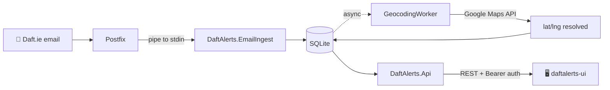

# 📬 DaftAlerts
{: .fs-9 }

Your Daft.ie inbox, organized.
{: .fs-6 .fw-300 }

[Get started](#quickstart){: .btn .btn-primary .fs-5 .mb-4 .mb-md-0 .mr-2 }
[View on GitHub](https://github.com/guibranco/daftalerts-api){: .btn .fs-5 .mb-4 .mb-md-0 }

---

## What is DaftAlerts?

DaftAlerts is a personal web application that ingests property alert emails
forwarded from [Daft.ie](https://www.daft.ie), parses them into structured
listings, geocodes each property via Google Maps, and serves a filtered REST
API to a separately-built React frontend. Built for a single user, it runs
on an Oracle Cloud Infrastructure Ubuntu VPS, receives mail via Postfix SMTP
piping, and stores everything in SQLite.

The stack:

- **.NET 10** — Minimal APIs + EF Core + Clean Architecture
- **SQLite** — file-based storage for properties, presets, raw emails
- **MimeKit + HtmlAgilityPack** — email parsing
- **Google Maps Geocoding API** — Eircode → lat/lng
- **Postfix** — SMTP ingress on the VPS
- **Docker + GitHub Actions** — build, test, release

---

## Documentation

<div class="code-example" markdown="1">

| Document | What's inside |
|:---|:---|
| [📐 Architecture]({{ '/architecture/' | relative_url }})     | Clean Architecture layers, project dependencies, data flow, and the three background workers that keep DaftAlerts running. |
| [🚀 Deployment]({{ '/deployment/' | relative_url }})         | Step-by-step production setup on an Oracle Cloud Ubuntu VPS — Postfix SMTP piping, systemd, Nginx, Let's Encrypt, and Docker Compose. |
| [🔍 Parser]({{ '/parser/' | relative_url }})                 | How the Daft.ie email parser works, including Outlook SafeLinks unwrapping and how to add new variants. |
| [🌐 API reference]({{ '/api/' | relative_url }})             | REST endpoint reference — authentication, filtering, pagination, bulk operations, and example requests. |
| [🧭 Decisions]({{ '/decisions/' | relative_url }})           | Architecture Decision Records with the trade-offs behind each major choice. |

</div>

---

## Quickstart

### Run with Docker

```bash
docker run -d \
  --name daftalerts-api \
  -p 5080:5080 \
  -v daftalerts-data:/var/lib/daftalerts \
  -e DaftAlerts__Auth__ApiToken=dev-local-token \
  -e DaftAlerts__Geocoding__GoogleApiKey=YOUR_KEY_HERE \
  ghcr.io/guibranco/daftalerts-api:latest
```

The API listens on `http://localhost:5080`. In development, Scalar API
docs are served at `/scalar/v1`.

### Run from source

```bash
git clone https://github.com/guibranco/daftalerts-api.git
cd daftalerts-api

dotnet restore DaftAlerts.sln
dotnet build DaftAlerts.sln --configuration Release

# Create schema
dotnet ef database update \
  --project src/DaftAlerts.Infrastructure \
  --startup-project src/DaftAlerts.Api

# Run
dotnet run --project src/DaftAlerts.Api
```

Full production setup (Postfix + systemd + Nginx + Let's Encrypt) is
covered in the [Deployment guide]({{ '/deployment/' | relative_url }}).

---

## Data flow at a glance



Details are in the [Architecture guide]({{ '/architecture/' | relative_url }}#data-flow).

---

## Related repositories

| Repo | Description |
|:---|:---|
| [guibranco/daftalerts-api](https://github.com/guibranco/daftalerts-api) | This repository — backend API and email ingestion |
| [guibranco/daftalerts-ui](https://github.com/guibranco/daftalerts-ui)   | React + Vite + TypeScript frontend |

---

## License

Distributed under the [MIT License](https://github.com/guibranco/daftalerts-api/blob/main/LICENSE).
